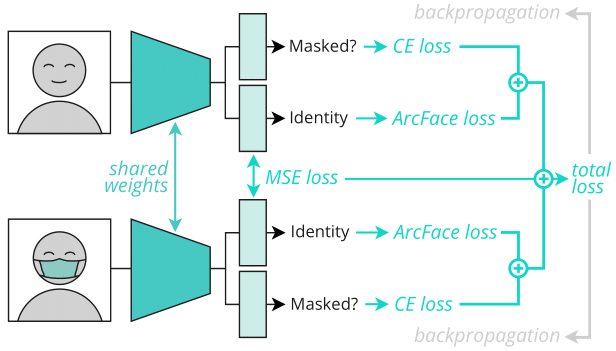

# FocusFace

This is the official repository of "FocusFace: Multi-task Contrastive Learning for Masked Face Recognition" accepted at *IEEE International Conference on Automatic Face and Gesture Recognition 2021 (FG2021)*.

 


Research Paper at:

* [Arxiv](https://arxiv.org/abs/2110.14940)
* [IEEE Xplore](https://ieeexplore.ieee.org/abstract/document/9666792)

## Table of Contents 

- [Abstract](#abstract)
- [Data](#data)
- [Citing](#citing)
- [Acknowledgement](#acknowledgement)
- [License](#license)

### Abstract ###

SARS-CoV-2 has presented direct and indirect challenges to the scientific community. One of the most prominent indirect challenges advents from the mandatory use of face masks in a large number of countries. Face recognition methods struggle to perform identity verification with similar accuracy on masked and unmasked individuals. It has been shown that the performance of these methods drops considerably in the presence of face masks, especially if the reference image is unmasked. We propose FocusFace, a multi-task architecture that uses contrastive learning  to be able to accurately perform masked face recognition. The proposed architecture is designed to be trained from scratch or to work on top of state-of-the-art face recognition methods without sacrificing the capabilities of a existing models in conventional face recognition tasks. We also explore different approaches to design the contrastive learning module. Results are presented in terms of masked-masked (M-M) and unmasked-masked (U-M) face verification performance. For both settings, the results are on par with published methods, but for M-M specifically, the proposed method was able to outperform all the solutions that it was compared to. We further show that when using our method on top of already existing methods the training computational costs decrease significantly while retaining similar performances. 

## Data ## 

### Datasets ###
The "MS1M-ArcFace (85K ids/5.8M images)" can be downloaded [here](https://github.com/deepinsight/insightface/tree/master/recognition/_datasets_). 

For all the datasets above, please strictly follow the licence distribution.

### Masks ###
The mask template used to create the synthetic masked data for training and evaluation is [MaskTheFace](https://github.com/aqeelanwar/MaskTheFace).


### Trained Models ###
Our models can be downloaded [here](https://drive.inesctec.pt/s/mKzZ6JGF52pxoc2).

### To-do 
- [X] Add pretrained models
- [ ] Add train script 
- [ ] Add evaluation script 

## Citing ##
If you use any of the code provided in this repository or the models provided, please cite the following paper:
```
@inproceedings{neto2021focusface,
  title={FocusFace: Multi-task Contrastive Learning for Masked Face Recognition},
  author={Neto, Pedro C and Boutros, Fadi and Pinto, Jo{\~a}o Ribeiro and Darner, Naser and Sequeira, Ana F and Cardoso, Jaime S},
  booktitle={2021 16th IEEE International Conference on Automatic Face and Gesture Recognition (FG 2021)},
  pages={01--08},
  year={2021},
  organization={IEEE}
}
```

## Acknowledgement ##

This work was financed by National Funds through the Portuguese funding agency, FCT - Fundação para a Ciência e a Tecnologia within project UIDB/50014/2020, and within the PhD grants ``2021.06872.BD'' and ``SFRH/BD/137720/2018''. This research work has been also funded by the German Federal Ministry of Education and Research and the Hessen State Ministry for Higher Education, Research and the Arts within their joint support of the National Research Center for Applied Cybersecurity ATHENE.

## License ##

This project is licensed under the terms of the MIT License.
